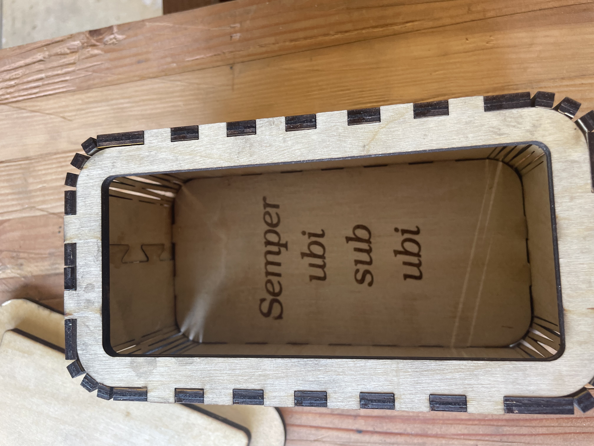
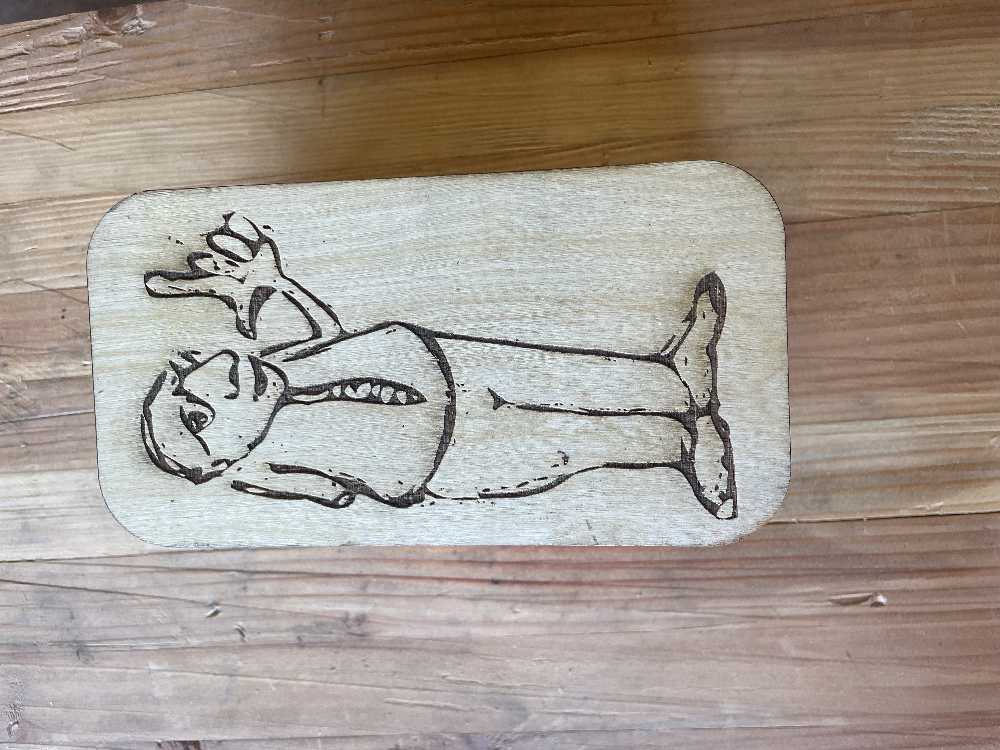

# Open source box  "Semper ubi sub ubi"

!
!

## Build instructions

Make one for yourself or your friends!  Please record your work in the [manifest](./MANIFEST.md),
including any adjustments you made for materials, etc.

## Support files
* [Raw SVG](drawing.svg)
* [XCS](drawing.xcs)
* [QR code image](qr.png)
